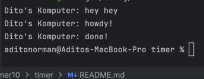

### Experiment 1.2: Understanding how it works

**Output:**

**Explanation:**
The line `"Dito's Komputer: hey hey"` prints immediately after spawning the asynchronous task. This is because the `spawn` method schedules the task but doesn't wait for it to complete. The main thread continues executing, hitting the `println!` line before the spawned task gets polled by the executor.

The executor then runs the task: it prints `"howdy!"`, waits for 2 seconds using the `TimerFuture`, and finally prints `"done!"`.

This shows how async tasks run concurrently with the main thread.

