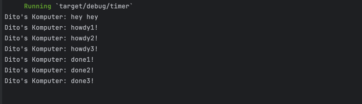

### Experiment 1.2: Understanding how it works

**Output:**

**Explanation:**
The line `"Dito's Komputer: hey hey"` prints immediately after spawning the asynchronous task. This is because the `spawn` method schedules the task but doesn't wait for it to complete. The main thread continues executing, hitting the `println!` line before the spawned task gets polled by the executor.

The executor then runs the task: it prints `"howdy!"`, waits for 2 seconds using the `TimerFuture`, and finally prints `"done!"`.

This shows how async tasks run concurrently with the main thread.

### Experiment 1.3: Multiple Spawn and removing drop

**Output (with drop):**

**Explanation:**

When multiple tasks are spawned using the `spawner.spawn(...)` function, each task runs concurrently and prints its output independently. In this experiment, three tasks were created, each printing a "howdyX!" message, waiting for two seconds using `TimerFuture`, and then printing "doneX!". The `println!("hey hey")` runs immediately because it is outside the asynchronous tasks. Since the tasks are scheduled simultaneously, the order of the "doneX!" messages may vary slightly between executions. Including the `drop(spawner)` statement is essential because it closes the task channel, signaling to the executor that no additional tasks will be submitted. If `drop(spawner)` is removed, the executor waits indefinitely, causing the program to hang even after all spawned tasks complete.